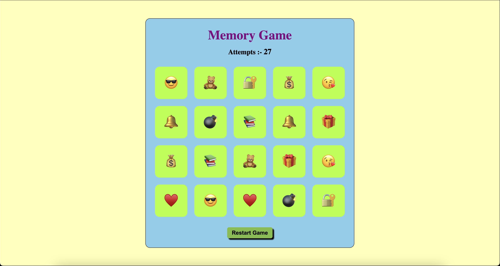

# Match Pair Game



## Table of Contents
- [Description](#description)
- [Features](#features)
- [Technologies Used](#technologies-used)
- [How to Play](#how-to-play)
- [File Structure](#file-structure)

- [License](#license)

## Description

The Match Pair Game, also known as the Memory Game, is a simple and engaging game where players need to find and match pairs of identical items. The game shuffles the cards on each restart, tracks the number of attempts, and provides a responsive user interface. This project is perfect for beginners learning web development or anyone looking to create a fun, interactive game.

## Features

- Shuffle cards on each game start
- Track the number of attempts
- Responsive UI with cards turning back if not matched
- Restart game button to shuffle and reset the game

## Technologies Used

- HTML
- CSS
- JavaScript

## How to Play

1. Click on any card to reveal its symbol.
2. Click on another card to try to find its pair.
3. If the two revealed cards match, they will remain visible.
4. If the two revealed cards do not match, they will be turned back over after a short delay.
5. Continue until all pairs are found.
6. The number of attempts is displayed at the top.
7. Click the "Restart Game" button to shuffle the cards and start a new game.

## File Structure

```js
Match-Pair-Game/
├── index.html
├── style.css
└── script.js
```
- `index.html`: The main HTML file containing the structure of the game.
- `style.css`: The CSS file for styling the game.
- `script.js`: The JavaScript file containing the game logic.

## License

This project is licensed under the MIT License.
